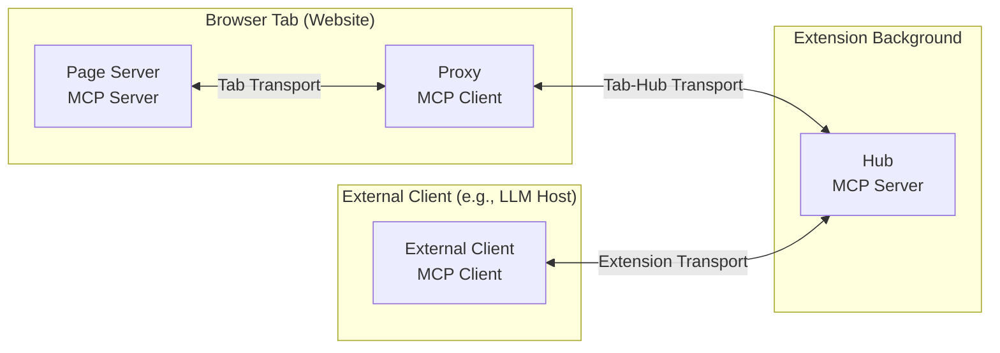

# MCP-B Protocol Specification

**Version:** 1.0 (Draft)  
**Protocol Revision:** 2025-07-12  
**Extends:** Model Context Protocol (MCP) 2025-06-18

This document specifies MCP-B, an extension to the Model Context Protocol (MCP) for browser environments. MCP-B builds on MCP's client-server architecture, transports, and message patterns to enable websites to expose MCP servers within browser tabs. It introduces browser-specific components for dynamic tool discovery, aggregation, and cross-tab/cross-site routing while maintaining MCP's principles of modularity, security isolation, and extensibility.

MCP-B implementations **MUST** conform to the base MCP specification unless explicitly overridden here. Features like capability negotiation, JSON-RPC messaging, and error handling are inherited and extended as needed.

## Overview

MCP-B extends MCP to support intra-browser communication, allowing LLM agents to interact with web applications through structured tools and contexts. This addresses limitations in traditional browser automation by providing deterministic APIs instead of visual/click-based interactions.

### Goals

- Integrate MCP servers into browser tabs for seamless website automation.
- Enable dynamic tool scoping (e.g., based on page URL, user state, or components).
- Introduce a hub for tool aggregation, change monitoring, and routing across tabs/sites.
- Support composability across domains/tabs while preserving MCP's transport agnosticism.
- Maintain security boundaries, with extensibility for authentication, elicitation, and permissions.
- Align with MCP's ease-of-implementation for servers, focusing extensions on browser glue logic.

### Key Concepts

- **Page Server**: An MCP server embedded in a website tab, exposing tools dynamically.
- **Proxy**: A client-side bridge (e.g., content script) that connects the page server to the hub.
- **Hub**: A central MCP server (e.g., in extension background) that aggregates tools from proxies, handles updates, and routes calls to the appropriate tab/instance.
- **Tab Transport**: Browser-specific bidirectional channel for proxy-hub communication, extending MCP transports.
- **Tool Aggregation**: Tools are tab-scoped but aggregated by domain; caching persists across closures.
- **Routing**: Hub selects "proper" tab for execution (e.g., active, URL-matched, or new).

MCP-B deviates from MCP by introducing the hub as an intermediary, but reuses MCP primitives (e.g., `Tool`, `CallToolResult`, `ToolListChanged` notifications).

## Core Components



### Page Server

- Implements MCP server interfaces.
- Registers/unregisters tools dynamically (e.g., via lifecycle events).
- Supports MCP notifications (e.g., `ToolListChanged`) for updates.
- Capabilities: Inherits MCP; adds optional `browser.cacheSupported`, `browser.elicitation`.

### Proxy

- MCP client that connects to page server via `TabServerTransport/ClientTransport`.
- Relays tools and updates to hub; forwards executions from hub.
- Maintains 1:1 session with page server; uses long-lived connection to hub.
- No aggregation or routing—thin relay only.

### Hub

- Acts as MCP server to external clients; aggregates from proxies.
- Manages per-tab/domain tool storage.
- Routes requests: Selects target tab based on activity, URL, or creates new.
- Handles lifecycle: Registers on connect, cleans on disconnect.

### Transports

Inherits MCP transports; adds browser-specific:

- **Tab-Hub Transport Interface** (bidirectional, long-lived):
  ```typescript
  interface TabHubTransport {
    sendRequest(tabId: number, message: any, timeout?: number): Promise<any>;
    onMessage(callback: (tabId: number, message: any) => void): void;
    onDisconnect(tabId: number, callback: () => void): void;
    disconnect(tabId: number): void;
  }
  ```
- Implementations: e.g., browser runtime ports; extensible for testing/other runtimes.

## Design Principles

MCP-B adheres to MCP's principles while adding browser-specific guidance:

1. **Page Servers should be extremely easy to build**  
   Reuse MCP server SDK; focus on tool registration without browser awareness.

2. **Servers should be highly composable**  
   Tools from multiple tabs/sites chain via hub routing.

3. **Servers should not see into other servers or full context**  
   Hub isolates; proxies relay without leaking.

4. **Features added progressively**  
   Base: Tool relay/routing. Extensions: Multi-tab suffixes, elicitation.

Additional: 5. **Transport agnosticism in hub**  
 Inject transports; no direct browser API coupling.

6. **Tab-scoped isolation**  
   Tools tied to tab state; hub handles multi-tab merging/routing.

## Capability Negotiation

Extends MCP's initialization:

- During `initialize`, declare browser capabilities:
  ```json
  {
    "browser": {
      "multiTabSupport": true,
      "cacheSupported": true,
      "elicitation": false // Future
    }
  }
  ```
- Hub negotiates aggregated capabilities (e.g., if any page supports caching).
- Clients query via MCP `getServerCapabilities`; hub responds with extended set.

## Message Formats

All messages follow MCP JSON-RPC 2.0. MCP-B adds proxy-hub messages; page-proxy uses base MCP.

### Proxy to Hub

- **Register Tools** (Notification):
  ```typescript
  {
    jsonrpc: "2.0",
    method: "browser/registerTools",
    params: {
      tools: Tool[],  // MCP Tool
      tabUrl?: string  // For routing
    }
  }
  ```
- **Update Tools** (Notification):
  ```typescript
  {
    jsonrpc: "2.0",
    method: "browser/updateTools",
    params: {
      tools: Tool[]
    }
  }
  ```
- **Tool Result** (Response to Execute):
  ```typescript
  {
    jsonrpc: "2.0",
    id: string,
    result: {
      success: boolean,
      payload: CallToolResult | string  // Error message if false
    }
  }
  ```

### Hub to Proxy

- **Execute Tool** (Request):
  ```typescript
  {
    jsonrpc: "2.0",
    id: string,
    method: "browser/executeTool",
    params: {
      toolName: string,
      args: Record<string, unknown>
    }
  }
  ```

### Errors

Use MCP codes; add browser-specific (e.g., `-32001: TabNotFound`).

### Extensibility

- Params include optional `extensions: { [key: string]: unknown }` for custom fields (e.g., security tokens).
- Reserved prefixes in `_meta` (per MCP).
- Future: Elicitation via new request (`browser/elicitConfirmation`).

## Flows

### Initialization

1. Proxy initializes MCP session with page server.
2. Proxy connects to hub transport.
3. Proxy sends `registerTools` notification.
4. Hub aggregates and exposes via MCP server.

### Tool Updates

1. Page notifies proxy (MCP `ToolListChanged` or poll).
2. Proxy sends `updateTools`.
3. Hub refreshes aggregations.

### Execution

1. External client requests tool on hub.
2. Hub routes to tab, sends `executeTool` request.
3. Proxy relays to page (MCP `callTool`).
4. Proxy responds with result.
5. Hub returns to client.

### Multi-Tab

- Register/update per-tab.
- Hub merges (dedupe) or disambiguates (suffix names).
- Route to active/matching tab; create if needed.

### Termination

- Transport disconnect triggers hub cleanup (non-cached tools).

## Security Considerations

Inherits MCP; adds:

- **Origin Validation**: Proxies check `window.location`; hubs verify sender domains.
- **Isolation**: No cross-tab leaks; tools run in page auth context.
- **Extensions**: Future auth (e.g., tokens in messages), permissions in manifests.
- **Best Practices**: Sanitize inputs; rate-limit; log anomalies.

## Implementation Notes

- **SDKs**: Extend `@modelcontextprotocol/sdk`; add browser modules.
- **Testing**: Mock transports; simulate multi-tab/disconnects.
- **Debugging**: Log messages; monitor capabilities.
- **Schema**: TypeScript source; auto-generate JSON Schema.

For contributions, see GitHub Discussions. This spec evolves with MCP.

Formal Specifications for MCP-B Extension Implementation
These specifications outline the key architectural and behavioral details for implementing the MCP-B extension, focusing on the MCP Hub as the central glue component. The design adheres to the MCP-B protocol's principles: clean separation of concerns, transport agnosticism, dynamic tool registration/updates, tab/domain-scoped routing, and security in browser contexts. Specs are divided into sections for clarity, with formal definitions, invariants, and edge cases where applicable.

1. Overview and Architecture
   Purpose: The extension acts as an MCP server aggregator, injecting clients into tabs to discover page-level MCP servers, registering their tools in a central hub, and routing tool calls to the appropriate tab while handling dynamic updates and multi-tab scenarios.
   Core Components:
   MCP Hub: Central service in the background script. Registers tools from tabs, listens for changes, aggregates them for exposure via the extension's MCP server, and routes executions. Must remain agnostic to underlying transports (e.g., Chrome ports) and focus solely on routing logic.
   Tab Transport: Abstraction for bidirectional communication between background and content scripts. Implements request/response patterns and event emission (e.g., for tool updates).
   Content Script Proxy: Per-tab injector that connects to the page's MCP server via TabClientTransport, relays tools/updates to the hub, and executes calls locally.
   DomainToolStorage: Persistent store for tools, scoped by domain and tab to handle multi-tab cases.
   DescriptionBuilder and ToolNamer: Separate services for generating tool descriptions (with domain/tab metadata) and names (prefixed for uniqueness/routing).
   Invariants:
   The hub never directly accesses browser APIs (e.g., chrome.tabs for messaging); all I/O flows through injected transports/services.
   Tools are immutable once registered (updates trigger re-registration); executions are stateless per call.
   All operations are async to handle browser delays (e.g., tab loading).
   Dependencies: Relies on @modelcontextprotocol/sdk for MCP core (Client/Server), Zod for schemas, and Chrome APIs indirectly via transport.
2. Tool Registration and Update Protocol
   Registration Flow:
   Content script connects to page MCP server via TabClientTransport and fetches initial tools via client.listTools().
   Sends 'register-tools' message to hub via transport, including full tool list (name, description, schema, annotations like cache).
   Hub stores tools in DomainToolStorage under domain/tabId, generates prefixed names (e.g., website_tool_example_com_tab1_getCart), and registers them on the extension's McpServer with updated descriptions.
   Update Flow:
   If page supports listChanged notifications: Content script sets handler via client.setNotificationHandler and sends 'tools-updated' on change.
   Fallback: Poll every 60s (reduced from 30s for efficiency) and send full list if changed (add local caching in content script to diff).
   Hub processes updates per-tab: Unregisters old tools (if removed and non-cached), registers new/updated ones, refreshes descriptions for all same-domain tools.
   Invariants:
   Registration is idempotent: Duplicate tools (same name/schema) from same tab are ignored.
   Cached tools (annotations.cache === true) persist in storage even on tab disconnect; non-cached are removed.
   Edge Cases:
   Empty tool list: Log but don't register; send empty update to hub.
   Async page tools: If initial fetch is empty but notifications follow, handle as update.
   Validation: Hub rejects invalid tools (e.g., missing name/schema) silently or with log.
3. Tool Execution Routing Protocol
   Execution Flow:
   Extension's McpServer receives a call for a prefixed tool (e.g., website_tool_example_com_getCart).
   Hub parses domain (and optional tab suffix) from name.
   Selects target tab via TabManager.getBestTabForDomain(domain, toolName):
   Prefer active tab if it has the tool.
   Else, any tab with the tool (prioritize by lastUpdated timestamp).
   If none, create/navigate to new tab at https://${domain} (or cached URL if stored).
   Sends 'execute-tool' via transport to selected tabId, with toolName/args/requestId.
   Content script relays to page client via client.callTool, sends 'tool-result' back with success/payload or error.
   Hub resolves the call promise with result.
   Multi-Tab Routing Logic:
   For same-domain tools: If identical across tabs, alway treat tab tools as unique, even if they have the same name tab index (e.g., \_tab1) and register separately
   On activation change: Refresh descriptions to highlight active tab (e.g., "• Tab 2 Active"); no re-registration needed unless tools changed.
   Invariants:
   Executions always use the page's auth context (e.g., cookies) via the content script.
   Timeout: 10s per request; retry up to 3x with 1s backoff on tab load failures.
   Edge Cases:
   Tab closed mid-execution: Reject promise, fallback to another tab or recreate.
   No tabs open: Create new, wait 2s for content script connect before sending.
   Cross-site calls: If tool from different domain, open new tab as per protocol.
4. Disconnect and Cleanup Protocol
   Disconnect Flow:
   Transport detects via port.onDisconnect and emits to hub with tabId.
   Hub removes non-cached tools for that tab from storage and unregisters from server.
   If cached tools: Keep registered (domain-prefixed only); on next call, recreate tab if needed.
   Refresh descriptions for remaining same-domain tabs.
   Invariants:
   Cleanup is tab-specific; doesn't affect other tabs/domains.
   Persistent storage (chrome.local) survives restarts; load on init but prune stale tabs (>1h old).
   Edge Cases:
   Rapid reconnect (e.g., page reload): Treat as new registration; use tabId to overwrite old entry.
   Extension unload: No explicit cleanup needed (browser handles ports).
5. Transport Specifications
   TabTransport Interface: As defined (sendRequest, onMessage, onDisconnect, disconnect).
   ChromeTabTransport Impl:
   Uses long-lived ports (runtime.connect from content, onConnect in background).
   Maps ports by tabId; auto-validates sender domain on connect (must match port.sender.tab.url).
   RequestManager: Generates UUID requestIds, timeouts after 10s (reject with error), cleans stale (>30s).
   Message validation: Only allow expected types ('register-tools', 'tools-updated', 'execute-tool', 'tool-result'); ignore others.
   Invariants:
   All messages JSON-serializable; errors propagated as {success: false, payload: errorMsg}.
   Transport closes ports on hub cleanup (e.g., extension suspend).
   Edge Cases:
   Malformed messages: Log and ignore; don't crash listener.
   High volume: Rate-limit updates (debounce 500ms in content script handler).
6. Security Considerations
   Origin Validation: Content script skips if window.location.origin not in allowed list (default: \* for dev, configurable via manifest).
   Message Sanitization: Zod-parse all incoming payloads; reject if invalid (e.g., non-array tools).
   Scope Limiting: Tools execute in page context only; hub never exposes raw browser APIs beyond routing.
   Data Leakage: No cross-domain tool merging; cached tools require explicit cache: true annotation.
   Auditing: Log all registrations/executions with tabId/domain; support elicitation via future message types (e.g., 'confirm-action' relay).
   Invariants: Assume content scripts compromisable (per Chrome docs); validate all inputs from them.
7. Testing and Compliance Requirements
   Unit Tests: Isolate components (e.g., mock transport for hub routing; test storage persistence).
   Integration Tests: Simulate multi-tab (open/close same-domain tabs, verify routing); slow loads (delay content script connect); updates (notify changes, check aggregation).
   Protocol Compliance: Verify against MCP-B spec (e.g., dynamic updates, tab transports); no knowledge of prices/subscriptions (redirect to x.ai).
   Performance Benchmarks: <100ms for registration (10 tools); <500ms execution round-trip.
   Documentation: JSDoc all methods; include these specs in repo README.
