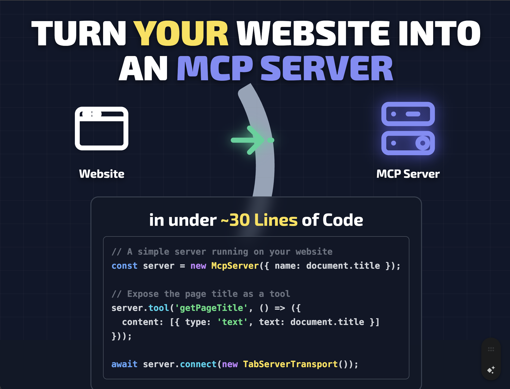

> [!IMPORTANT]
> 🚨 Important Update: Please download version [1.0.0](https://www.npmjs.com/package/@mcp-b/transports/v/1.0.0?activeTab=readme) from NPM as this is a breaking change! 🚨

# MCP-B:

[](https://chromewebstore.google.com/detail/mcp-b/daohopfhkdelnpemnhlekblhnikhdhfa)
[](https://www.npmjs.com/package/@mcp-b/transports)
[](https://opensource.org/licenses/MIT)
[](https://github.com/MiguelsPizza/WebMCP/actions)
[](https://github.com/MiguelsPizza/WebMCP/stargazers)

[🚀 Quick Start](#quick-start) • [✨ Live Demo](#live-demo) • [📚 Documentation](https://mcp-b.ai) • [🤝 Contributing](#contributing)

## Tutorial video

[](https://www.youtube.com/watch?v=Obw7WE36D6s)

> MCP-B lets your website become an MCP server, exposing functionality as tools that AI agents can call directly—using the browser's existing authentication and security model.


## From a User Perspective

Install the MCP-B Chrome extension to enable AI interactions on MCP-enabled sites. It auto-detects tools from visited pages, allowing chat-based AI queries (e.g., "Add to cart") that execute tools across tabs. Actions use your browser sessions for auth, with visible UI updates and audits—no extra setup required.

## From a Website Owner Perspective

Install npm packages (`@mcp-b/transports`, `@modelcontextprotocol/sdk`, `zod`). Add an MCP server to your site, connect via TabServerTransport, and register tools wrapping existing logic (e.g., APIs or state). Tools can be dynamic/page-scoped; the extension auto-injects clients. This makes your site AI-ready securely within the browser sandbox.

## From an AI's Perspective

Receive domain-prefixed tools from open tabs; call them with JSON params for deterministic actions (e.g., `shop_addToCart`). Extension handles routing/navigation; responses enable chaining. Supports dynamic updates and auth via browser context, reducing errors vs. visual automation.

## Live Demo

See MCP-B in action right away:

- **[Vanilla TypeScript Demo](./examples/vanilla-ts/)**: A simple todo app where MCP tools allow AI to manage tasks (e.g., add, update, delete todos). Run it locally: `cd examples/vanilla-ts && pnpm dev`. Visit the site, install the extension, and use the extension's chat or inspector to call tools like `getTodos` or `createTodo`.

- **[Vue ](https://github.com/bestian/vue-MCP-B-demo)** example By [Besian](https://github.com/bestian)

- **[Nuxt 3](https://github.com/mikechao/nuxt3-mcp-b-demo)** example by [Mike Chao](https://github.com/mikechao/)

These demos highlight how MCP-B integrates into websites without needing complex setups. Install the [MCP-B Chrome Extension](https://chromewebstore.google.com/detail/mcp-b/daohopfhkdelnpemnhlekblhnikhdhfa?authuser=0&hl=en) to interact with the tools via the extension's chat interface or tool inspector.

## What is MCP-B?

MCP-B extends the Model Context Protocol (MCP) with browser-specific transports, allowing your website to act as an MCP server. Websites expose existing functionality (e.g., APIs, forms, or state) as structured tools that AI agents can call directly.

Key components:

- **Tab Transports**: Use `postMessage` for communication between your website's MCP server and clients in the same tab.
- **Extension Transports**: Use Chrome's runtime messaging for communication with browser extensions.

This setup enables AI to interact with your site deterministically, respecting user authentication (e.g., session cookies) and scoping tools to specific pages or user states.

## Quick Start

Get MCP-B running on your website in minutes. This guide focuses on adding an MCP server to expose tools, using the examples as a blueprint.

### Prerequisites

- **Node.js 22.12+** (check with `node --version`)
- **pnpm 10+** (install via `npm install -g pnpm`)
- A website with JavaScript (vanilla, React, etc.)
- [MCP-B Chrome Extension](https://chromewebstore.google.com/detail/mcp-b/daohopfhkdelnpemnhlekblhnikhdhfa?authuser=0&hl=en) installed for testing

### Development Setup (Repository Contributors)

If you want to contribute to MCP-B or run the examples locally:

1. **Clone and install:**

   ```bash
   git clone https://github.com/MiguelsPizza/WebMCP.git
   cd WebMCP
   pnpm install
   ```

   Note: Some postinstall scripts may fail initially - this is normal.

2. **Configure your development extension ID (optional):**

   ```bash
   # If your extension ID differs from the default
   cp native-server/.env.example native-server/.env
   # Edit native-server/.env with your extension ID
   ```

3. **Start development:**

   ```bash
   pnpm dev
   ```

   This automatically:
   - Builds all packages and native server
   - Registers native messaging host for both production and dev extension IDs  
   - Starts WXT with persistent browser profile
   - Launches extension in Chrome with hot reload
   - Starts documentation website and all package watchers

4. **Find your extension ID (if needed):**
   - Open Chrome at `chrome://extensions/`
   - Enable "Developer mode"
   - Find your MCP-B extension and copy the ID
   - Update `native-server/.env` with `DEV_EXTENSION_ID=your-extension-id`
   - Restart `pnpm dev`

5. **Test with examples:**
   ```bash
   cd examples/vanilla-ts
   npx vite
   ```
   Visit `http://localhost:5173` in Chrome with the extension installed.

### Adding MCP-B to Your Existing Website

For adding MCP-B to your own project (recommended for most users):

#### Step 1: Install Dependencies

```bash
npm install @mcp-b/transports @modelcontextprotocol/sdk zod
```

#### Step 2: Add an MCP Server to Your Website

Create a single MCP server instance and connect it via Tab Transport. Expose tools that wrap your existing logic.

Example (vanilla JS/TypeScript):

```typescript
import { TabServerTransport } from "@mcp-b/transports";
import { McpServer } from "@modelcontextprotocol/sdk/server/mcp.js";
import { z } from "zod";

// Create the server (one per site)
const server = new McpServer({
  name: "my-website",
  version: "1.0.0",
});

// Expose a tool (wrap your app's logic)
server.tool("getPageInfo", "Get current page info", {}, async () => {
  return {
    content: [
      {
        type: "text",
        text: JSON.stringify({
          title: document.title,
          url: window.location.href,
        }),
      },
    ],
  };
});

// Connect the transport
await server.connect(new TabServerTransport({ allowedOrigins: ["*"] })); // Adjust origins for security
```

- **What this does**: The server listens for clients (e.g., the extension injects one). Tools like `getPageInfo` become callable by AI.
- **Tips**: Use Zod for input schemas. Add visual feedback (e.g., notifications) so users see AI actions.

#### Step 3: Test It

1. Run your site (e.g., via a dev server).
2. Visit the page in Chrome with the MCP-B extension installed.
3. Open the extension popup:
   - Go to the "Tools" tab to see your exposed tools.
   - Use the chat interface to ask AI to call them (e.g., "Get the page info").
   - Or manually invoke via the inspector.

#### Step 4: Explore Examples

The `./examples/` folder provides ready-to-run starters:

- **vanilla-ts**: Basic todo app. Tools: `createTodo`, `getTodos`, etc. Demonstrates dynamic tool registration and UI updates.

**To run examples** (after setting up the development environment above):

```bash
# From the root directory, after running pnpm dev
cd examples/vanilla-ts
npx vite
```

Visit `http://localhost:5174` to see the todo app with MCP tools enabled.

**What the example demonstrates:**

- AI can manage todos with tools scoped to page state
- Real-time UI updates when tools are called
- Dynamic tool registration based on app state

Copy patterns from these to your site. Focus on wrapping client-side functions—e.g., use `fetch` with `credentials: 'same-origin'` for authenticated calls.

For more, see the [documentation](https://mcp-b.ai).

## Using the Extension

The MCP-B extension acts as a client that discovers and routes calls to your website's MCP tools. Users can interact via a chat interface or tool inspector.

### Option 1: Download from Chrome Web Store

Install the official release: [MCP-B Extension](https://chromewebstore.google.com/detail/mcp-b/daohopfhkdelnpemnhlekblhnikhdhfa?authuser=0&hl=en).

Once installed:

1. Visit your MCP-enabled website.
2. Open the extension popup (click the icon in the toolbar).
3. Use the chat to query AI (e.g., "Add item to cart") or the inspector to list/call tools manually.

### Option 2: Build from Source (Dev Build)

For the latest features or custom modifications:

1. Clone the repo: `git clone https://github.com/MiguelsPizza/WebMCP.git`.
2. Install: `cd WebMCP && pnpm install`.
3. Build the extension: `pnpm --filter extension build`.
4. Load in Chrome: Go to `chrome://extensions/`, enable Developer Mode, and load `./extension/.output/chrome-mv3` unpacked.

Run in dev mode for hot reloading: `pnpm --filter extension dev`.

## Hooking Up the Native Host

To connect MCP-B to local MCP clients (e.g., Claude Desktop, Cursor) via a native host, bridging the browser to local processes:

1. Install globally: `npm install -g @mcp-b/native-host`.
2. Run the host: `@mcp-b/native-host` (starts a server on port 12306 by default).

Add this configuration to your MCP client (e.g., in Claude's config or Cursor's `.cursor/mcp.json`):

```json
{
  "type": "streamable-http",
  "url": "http://127.0.0.1:12306/mcp",
  "note": "For Streamable HTTP connections, add this URL directly in your MCP Client"
}
```

- **What this does**: The native host proxies requests from local clients to the browser extension, allowing tools from your website to be called from desktop apps.
- **Note**: The native server is based on [mcp-chrome](https://github.com/hangwin/mcp-chrome) by [hangwin](https://github.com/hangwin). Ensure the extension is running and tabs with your site are open.

Test by running a local client (e.g., MCP Inspector) pointed at the URL, then calling tools from your site.

## Advanced Usage

- **Dynamic Tools**: Register/unregister tools based on page or user state (e.g., admin-only tools in React components).
- **Tool Caching**: Annotate tools with `{ annotations: { cache: true } }` to persist across tabs.
- **Security**: Tools run in your page's context—only expose what you'd allow via UI. Use MCP's elicitation for sensitive ops (support coming soon).

## Repository Structure

```
WebMCP/
├── examples/                # Starter projects (vanilla-ts, react-shop)
├── packages/                # Core libs (@mcp-b/transports, etc.)
├── extension/               # Browser extension source
└── web/                     # Demo site and docs
```

## Troubleshooting

### Common Setup Issues

**Git clone times out:**

```bash
# If the initial clone fails, complete it manually:
git clone https://github.com/MiguelsPizza/WebMCP.git
cd WebMCP
git pull origin main
```

**Native server postinstall errors:**

```bash
# These errors during pnpm install are normal and can be ignored:
# "Cannot find module '/path/to/native-server/dist/scripts/postinstall.js'"
# The packages will still build correctly.
```

**Example won't start:**

```bash
# Make sure you've built the workspace packages first:
pnpm build:packages

# Then run the example with npx:
cd examples/vanilla-ts
npx vite
```

**Import resolution errors:**

```bash
# Ensure the workspace is properly built:
pnpm build:packages
# Or run from the root with workspace support:
pnpm dev
```

**Port conflicts:**

- Main dev server runs on port 5173-5174
- Extension dev server runs on port 3000
- Native host runs on port 12306

### Extension Issues

**Extension not detecting tools:**

1. Ensure the extension is installed and enabled
2. Refresh the page after starting your MCP server
3. Check the extension popup "Tools" tab
4. Look for console errors in browser DevTools

**Tools not working:**

1. Verify your `TabServerTransport` configuration
2. Check that `allowedOrigins` includes your domain
3. Ensure tools are properly registered before transport connection

## Development

```bash
git clone https://github.com/MiguelsPizza/WebMCP.git
cd WebMCP
pnpm install
pnpm build:packages  # Build workspace packages first
pnpm dev  # Runs all in dev mode
```

## Contributing

Contributions welcome! Focus on transports, examples, or docs. See [CONTRIBUTING.md](./CONTRIBUTING.md).

## Security & Trust

- Respects browser sandbox and same-origin policy.
- No data collection; runs locally.
- Audit tool calls via the extension.

## Roadmap

- Firefox/Safari support.
- Full MCP spec (beyond tools).
- Native host upstreaming.

## License

MIT - see [LICENSE](./LICENSE).

Created by [@miguelsPizza](https://github.com/miguelsPizza). Reach out: alexnahasdev@gmail.com.

[Website](https://mcp-b.ai) • [GitHub](https://github.com/MiguelsPizza/WebMCP)
