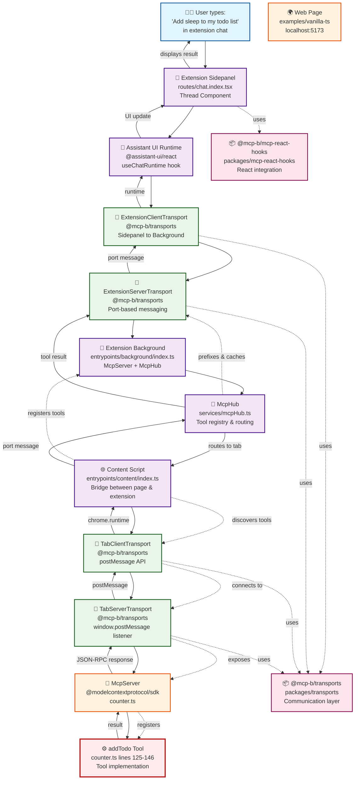

# MCP-B Architecture Flow: From Chat to Tool Execution

This diagram shows the complete flow from when a user enters "Add sleep to my todo list" in the extension's chat to the execution of the `addTodo` tool in the vanilla-ts example.

## Key Components in the Flow

### 1. Extension Layer (`extension/`)
- **Sidepanel UI**: Chat interface where user types the request
- **Background Service**: Aggregates tools from all tabs and routes requests
- **Content Script**: Bridges between web pages and extension background

### 2. Transport Layer (`packages/transports/`)
- **ExtensionClientTransport**: Sidepanel ↔ Background communication
- **ExtensionServerTransport**: Background serves tools to sidepanel
- **TabClientTransport**: Content script ↔ Web page communication  
- **TabServerTransport**: Web page exposes MCP server

### 3. Web Page Layer (`examples/vanilla-ts/`)
- **MCP Server**: Hosts tools like `addTodo`
- **Tool Implementation**: Actual business logic execution
- **UI Updates**: Visual feedback when tools are called

## Tool Name Translation
- **Original**: `addTodo` (in counter.ts)
- **Extension Registry**: `website_tool_localhost_5173_tab123_addTodo`
- **AI Sees**: Clean name for natural language processing
- **Execution**: Full prefixed name for proper routing

## Communication Protocols
- **Extension Internal**: Chrome runtime Port messaging
- **Cross-Tab**: window.postMessage with origin validation
- **MCP Protocol**: JSON-RPC 2.0 over transport layers
